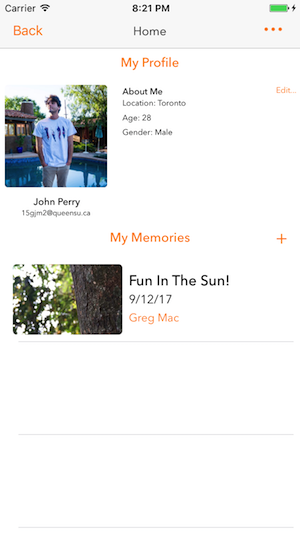
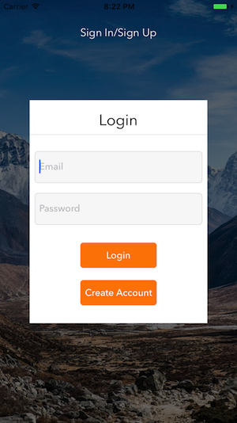
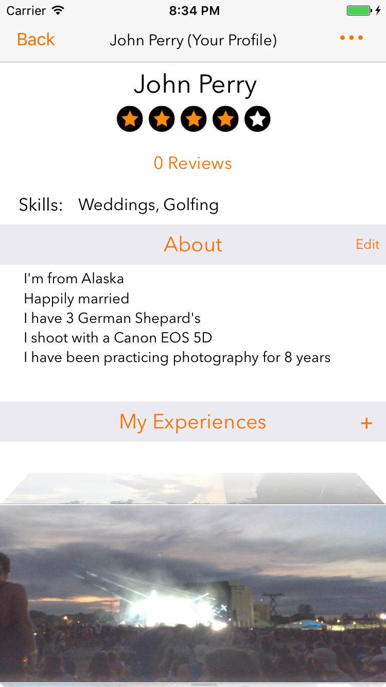

# Foto
This is a marketplace iOS application written in Swift which can locate local content creators in your area and help you get in contact with them! 
<h3 align="center">
]

</h3>

## Getting Started

1. Open the file "NewProduct.xcworkspace".

## Compatibility

This project is written in Swift 3.0 and requires Xcode 8.3.3 to build and run.

Foto is compatible with iOS 9.1+.

## Built With

This application utilizes the cocoapods framework using dependencies such as:

* [Firebase](https://cocoapods.org/?q=firebase) - The backend used
* [Cosmos](https://github.com/evgenyneu/Cosmos) - Rating Dependancy
* [DropDown](https://github.com/AssistoLab/DropDown) - Used to create a simple dropdown menu
* [JSQMessageViewController](https://github.com/jessesquires/JSQMessagesViewController) - Used to implement the UI of the chat feature
* [SDWebImage](https://github.com/rs/SDWebImage) - Asynchronous image downloader
* [PayPal SDK](https://github.com/paypal/PayPal-iOS-SDK) - UI for a paypal feature. Not implemented yet.

## Author

Gregory MacEachern

## License

Copyright 2017 Gregory MacEachern.

Licensed under MIT License: https://opensource.org/licenses/MIT
